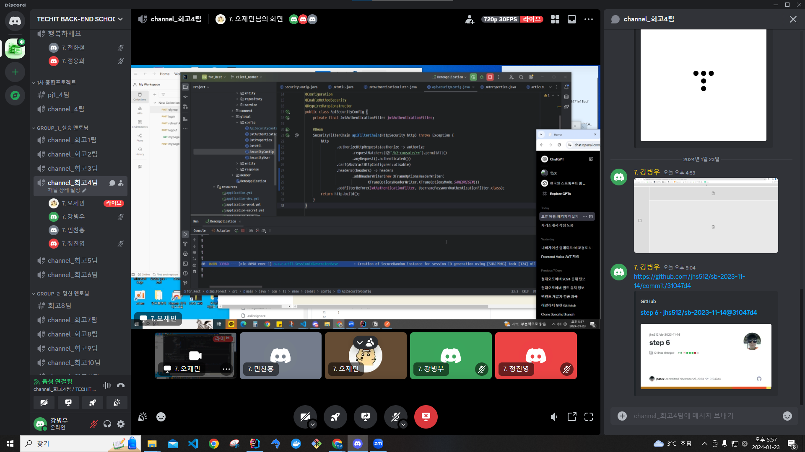
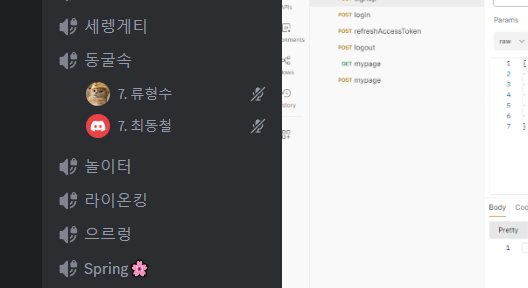
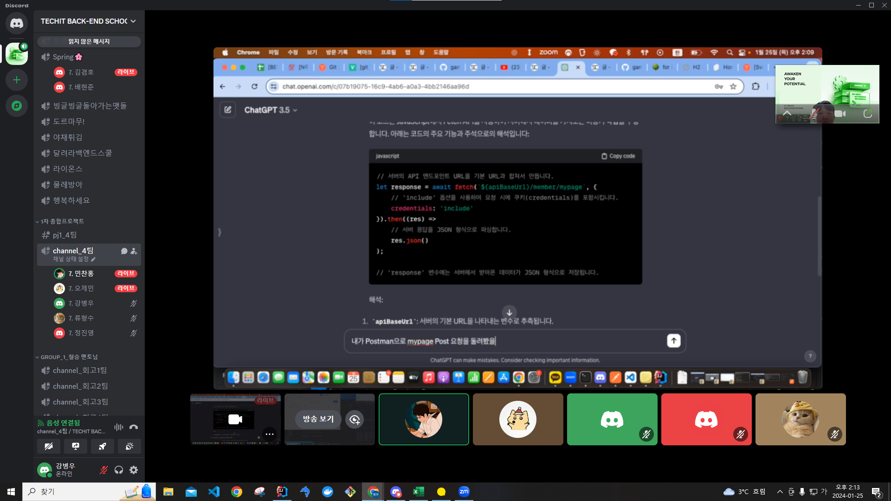
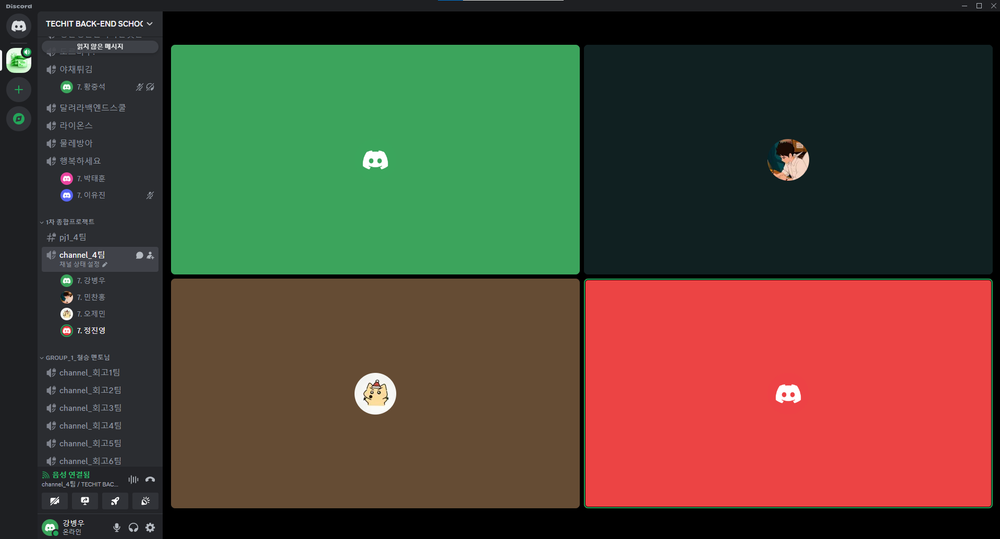

## 팀 구성원, 개인 별 역할

---

강병우, 정진영 - article 도메인 구현

민찬홍, 오제민 - member 도메인 구현

류형수, 최동철 - comment 도메인 구현

## 팀 내부 회의 진행 회차 및 일자

---

1회차(2024.01.22) 디스코드 미팅 진행
    - 참여인원: 강병우, 민찬홍, 오제민, 정진영, 최동철, 류형수

2회차(2024.01.23) 디스코드 미팅 진행
    - 참여인원: 강병우, 민찬홍, 오제민, 정진영, 류형수, 최동철

3회차(2024.01.24) 디스코드 미팅 진행
    - 참여인원: 강병우, 민찬홍, 오제민, 정진영, 류형수, 최동철

4회차(2024.01.25) 디스코드 미팅 진행
    - 참여인원: 강병우, 민찬홍, 오제민, 정진영, 류형수

5회차(2024.01.26) 디스코드 미팅 진행
    - 참여인원: 강병우, 민찬홍, 오제민, 정진영

6회차(2024.01.28) 오프라인 미팅 진행
    - 참여인원: 오제민, 민찬홍

## 현재까지 개발 과정 요약 (최소 500자 이상)

---

현재까지 진행하고 있는 개발 현황을 기능별 목표, 목표달성률, 성과자체평가(상세히) 작성해주세요.

- article 도메인
    - CRUD: 100%
    - 스벨트킷을 통한 프론트 앱 개발 시작 준비

- member 도메인
    - CRUD: 100%
    - 스벨트킷을 통한 프론트 앱 개발 진행중

- comment 도메인
    - CRUD: 100%
    - 스벨트킷을 통한 프론트 앱 개발 시작 준비    

## 개발 과정에서 나왔던 질문 (최소 200자 이상)

---

- 특정 코드에서 굳이 async랑 await를 써야하는지, 써야된다면 그 이유가 무엇인지. 
- 지금 우리 코드를 확인해보니 accessToken이랑 refreshToken이 쿠키에 담겨오는건 확인이 되는데 이게 어떤 로직으로 프론트쪽에서 API 요청을 할때마다 포함되어서 가는지 

## 개발 결과물 공유

---

Github Repository URL: https://github.com/four-Rest/Img_Forest

