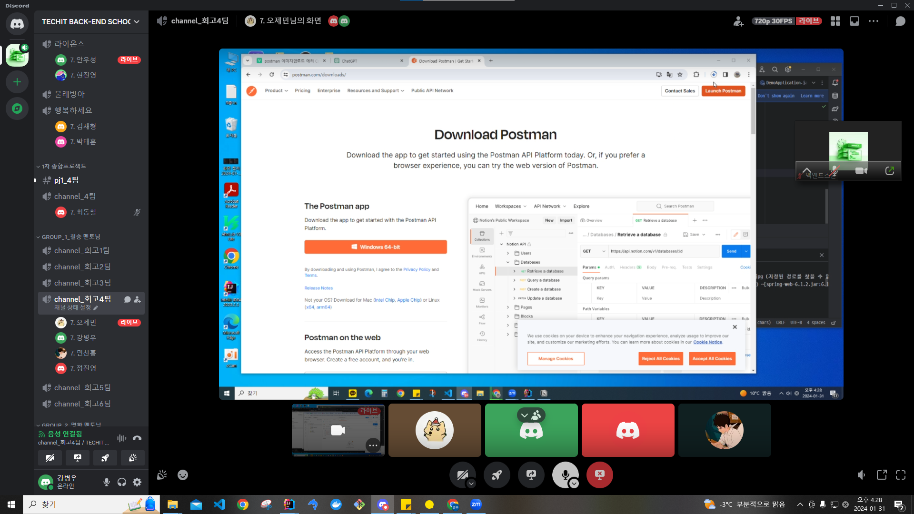

## 팀 구성원, 개인 별 역할

---

강병우, 정진영 - article 도메인 구현

민찬홍, 오제민 - member 도메인 구현

류형수, 최동철 - comment 도메인 구현

## 팀 내부 회의 진행 회차 및 일자

---

1회차(2024.01.29) 디스코드 미팅 진행
    - 참여인원: 강병우, 민찬홍, 오제민, 정진영

2회차(2024.01.30) 디스코드 미팅 진행
    - 참여인원: 강병우, 오제민, 정진영

3회차(2024.01.31) 디스코드 미팅 진행
    - 참여인원: 강병우, 민찬홍, 오제민, 정진영

4회차(2024.02.01) 디스코드 미팅 진행
    - 참여인원: 강병우, 민찬홍, 오제민, 정진영

5회차(2024.02.02) 디스코드 미팅 진행
    - 참여인원: 강병우, 민찬홍, 오제민, 정진영

6회차(2024.02.04) 오프라인 미팅 진행
    - 참여인원: 오제민, 민찬홍

## 현재까지 개발 과정 요약 (최소 500자 이상)

---

현재까지 진행하고 있는 개발 현황을 기능별 목표, 목표달성률, 성과자체평가(상세히) 작성해주세요.

백엔드 개발 1차 완료.

프론트 개발(스벨트)
    - 로그인, 회원가입, 개인정보 수정
    - 게시물 전체 조회

    - 게시물 상세조회, 생성(구현중)

-> 리액트로 변경

## 개발 과정에서 나왔던 질문 (최소 200자 이상)

---

- 현재 Article 엔티티의 Set<Tag> tags와Tag엔티티의 Set<Article> articles는 다대다(@ManyToMany)관계로 맵핑되어 있음. 이 때 Cascade를 사용해야 할지 직접 변경하는 로직을 생성해 사용해야 할지
- 페이지 전부 +page.svelte 이런 네이밍 형식을 사용해야하는지,, 이러면 네이밍만 보고 구분이 힘들지않나. 전 프로젝트에서는 패키지를 하나하나 만들어서 넣어놨는데 그렇게해야되는지 굳이 
- masonry 사용법
- 컴포넌트화 관련
- 외부 템플릿 관련
- 프론트 프레임워크(스벨트 → 리액트) 질문

## 개발 결과물 공유

---

Github Repository URL: https://github.com/four-Rest/Img_Forest

